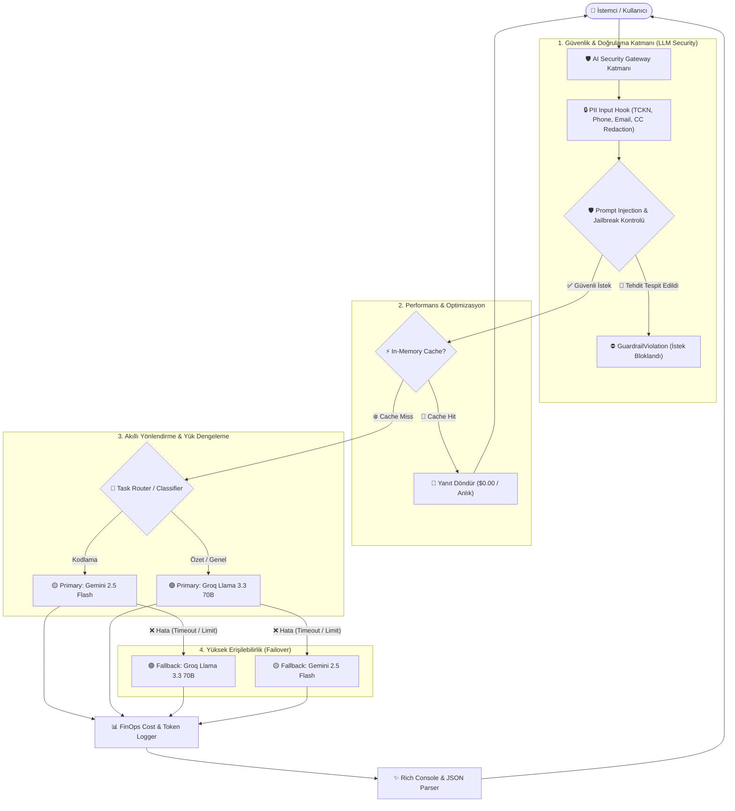

# 🛡️ Enterprise LLM Security Gateway & Multi-Provider Orchestration

[](https://python.org)
[](https://docs.litellm.ai)
[](https://python.langchain.com)
[](https://owasp.org/www-project-top-10-for-large-language-model-applications/)
[](#-6-llm-security--veri-gizliliği-pii-sanitization)

> **Kurumsal düzeyde LLM güvenliği, dinamik model yönlendirme, yüksek erişilebilirlik (failover), FinOps maliyet gözlemlenebilirliği ve PII/Prompt Injection savunma katmanlarını içeren uçtan uca LiteLLM Gateway mimarisi.**

---

## 📌 İçindekiler
- [Mimari Genel Bakış](#-mimari-genel-bakış)
- [Temel Özellikler](#-temel-özellikler)
- [Mimari Akış Diyagramı](#-mimari-akış-diyagramı)
- [Modüler Teknik İnceleme](#-modüler-teknik-inceleme)
  - [1. Çoklu Sağlayıcı Entegrasyonu (Multi-Provider Abstraction)](#1-çoklu-sağlayıcı-entegrasyonu-multi-provider-abstraction)
  - [2. Dayanıklılık ve Otomatik Hata Kurtarma (Fallback Chains)](#2-dayanıklılık-ve-otomatik-hata-kurtarma-fallback-chains)
  - [3. FinOps: Anlık Maliyet ve Token Analitiği](#3-finops-anlık-maliyet-ve-token-analitiği)
  - [4. Yüksek Performanslı In-Memory Önbellekleme (Caching)](#4-yüksek-performanslı-in-memory-önbellekleme-caching)
  - [5. Yük Dengeleme ve Model Havuzları (Load Balancing & Router)](#5-yük-dengeleme-ve-model-havuzları-load-balancing--router)
  - [6. Görev Odaklı Akıllı Yönlendirme (Task-Based Smart Routing)](#6-görev-odaklı-akıllı-yönlendirme-task-based-smart-routing)
  - [7. LangChain & LCEL Entegrasyonu](#7-langchain--lcel-entegrasyonu)
  - [8. LLM Security: PII Veri Maskeleme (KVKK / GDPR Sanitization)](#8-llm-security-pii-veri-maskeleme-kvkk--gdpr-sanitization)
  - [9. LLM Security: Prompt Injection & Jailbreak Savunması (OWASP LLM01)](#9-llm-security-prompt-injection--jailbreak-savunması-owasp-llm01)
- [Tehdit Modelleme Matrisi (OWASP LLM Top 10)](#-tehdit-modelleme-matrisi-owasp-llm-top-10)
- [Kurulum ve Başlangıç](#-kurulum-ve-başlangıç)
- [Proje Yapısı](#-proje-yapısı)
- [Teknoloji Yığını](#-teknoloji-yığını)

---

## 🏗️ Mimari Genel Bakış

Büyük Dil Modellerinin (LLM) kurumsal sistemlere entegrasyonu; **güvenlik zafiyetleri (Prompt Injection, Jailbreak)**, **veri sızıntıları (PII Disclosure)**, **tedarikçi kilitlenmesi (Vendor Lock-in)**, **beklenmedik maliyetler** ve **servis kesintileri (SLA ihlalleri)** gibi kritik riskler barındırır.

Bu proje (`gateway.ipynb`), bu zorlukları aşmak için **LiteLLM** çekirdeğinde geliştirilmiş çok katmanlı bir **AI Security Gateway** çözümüdür. Gelen tüm kullanıcı girdileri merkezi güvenlik filtrelerinden (PII Scrubbing & Injection Firewall) geçirilir, optimize edilmiş önbellekten yanıtlanır veya en uygun maliyet/performans oranına sahip modele akıllıca yönlendirilir.

---

## ✨ Temel Özellikler

| Yetenek | Açıklama |
| :--- | :--- |
| **🛡️ OWASP LLM01 Savunması** | Regex tabanlı derin semantik kurallarla Jailbreak, DAN ve System Prompt ifşa girişimlerini modele ulaşmadan engeller. |
| **🔒 PII Maskeleme (KVKK/GDPR)** | TCKN, TR Telefon, E-posta, Kredi Kartı ve IP adreslerini API çağrısı öncesinde otomatik olarak maskeler (`<TYPE_REDACTED>`). |
| **🔄 Zero-Downtime Fallback** | Birinci derece sağlayıcıda hata (Rate-Limit, 5xx, Outage) yaşandığında kesintisiz olarak yedek sağlayıcıya geçer. |
| **⚡ Akıllı Caching** | Tekrarlanan sorguları in-memory önbellekten **0.00$ maliyet** ve **10x-50x hızla** döndürür. |
| **⚖️ Router & Load Balancing** | Eşit model havuzları (`simple-shuffle`) ile yükü sağlayıcılar (Google, Groq, Anthropic vb.) arasında dengeler. |
| **🧠 Smart Intent Classifier** | Sorgunun içeriğine göre (`code`, `summary`, `general`) en ekonomik ve yetkin modeli dinamik seçer. |
| **💰 FinOps Gözlemlenebilirliği** | Yapılan her API çağrısının token ve mikro-dolar düzeyindeki kesin maliyetini anlık hesaplar. |

---

## 📐 Mimari Akış Diyagramı



---

## 🔍 Modüler Teknik İnceleme

### 1. Çoklu Sağlayıcı Entegrasyonu (Multi-Provider Abstraction)
LiteLLM, OpenAI uyumlu standart bir arabirim sağlayarak Google Gemini, Groq, Anthropic ve OpenAI modellerini tek bir imza üzerinden yönetir:

```python
from litellm import completion

# Model dizesi üzerinden sağlayıcı ve model ailesi belirlenir
response = completion(
    model="groq/llama-3.3-70b-versatile",
    messages=[{"role": "user", "content": "Explain basketball in one sentence."}],
    max_tokens=100
)
```

---

### 2. Dayanıklılık ve Otomatik Hata Kurtarma (Fallback Chains)
Kurumsal SLA'leri korumak amacıyla ana modelde erişim sorunu veya geçici kesinti yaşandığında tanımlanan fallback zinciri devreye girer:

```python
response = completion(
    model="gemini/gemini-2.5-flash",              # Birincil Model
    fallbacks=["groq/llama-3.3-70b-versatile"],   # Yedek Model Zinciri
    messages=[{"role": "user", "content": "What is an enterprise gateway?"}],
    max_tokens=150
)
# response.model üzerinden yanıtın hangi sağlayıcı tarafından üretildiği şeffafça izlenir.
```

---

### 3. FinOps: Anlık Maliyet ve Token Analitiği
Her model çağrısının girdisi (`prompt_tokens`) ve çıktısı (`completion_tokens`) üzerinden anlık mikro-maliyet hesaplaması yapılır:

```python
from litellm import completion, completion_cost

response = completion(
    model="gemini/gemini-2.5-flash",
    messages=[{"role": "user", "content": "Write a short poem about AI."}]
)

cost = completion_cost(completion_response=response)
print(f"Cost: ${cost:.8f} | Total Tokens: {response.usage.total_tokens}")
```

---

### 4. Yüksek Performanslı In-Memory Önbellekleme (Caching)
Özdeş sorgularda API çağrısı yapmadan yerel bellekten doğrudan yanıt sunarak hem ağ gecikmesini hem de API maliyetlerini minimize eder:

```python
import litellm
from litellm.caching import Cache

# Yerel bellek önbelleklemesini aktifleştirme
litellm.cache = Cache(type="local")

response = completion(
    model="gemini/gemini-2.5-flash",
    messages=[{"role": "user", "content": "What does LLM stand for?"}],
    caching=True
)
# 1. Çağrı (Cache Miss): ~0.8 sn (Standart API Ücreti)
# 2. Çağrı (Cache Hit):  ~0.001 sn ($0.00 Maliyet - ~50x Hızlandırma)
```

---

### 5. Yük Dengeleme ve Model Havuzları (Load Balancing & Router)
İstek yoğunluğunu birden çok anahtar veya sağlayıcı arasında paylaştırmak için sanal model havuzları ve yük dağıtım stratejileri uygulanır:

```python
from litellm import Router

model_list = [
    {
        "model_name": "my-model-pool",
        "litellm_params": {"model": "gemini/gemini-2.5-flash", "api_key": os.getenv("GOOGLE_API_KEY")},
        "model_info": {"id": "gemini-flash"}
    },
    {
        "model_name": "my-model-pool",
        "litellm_params": {"model": "groq/llama-3.3-70b-versatile", "api_key": os.getenv("GROQ_API_KEY")},
        "model_info": {"id": "groq-llama"}
    }
]

router = Router(model_list=model_list, routing_strategy="simple-shuffle")
response = router.completion(model="my-model-pool", messages=[...])
```

---

### 6. Görev Odaklı Akıllı Yönlendirme (Task-Based Smart Routing)
Hafif ve ultra hızlı bir sınıflandırıcı (Groq Llama 3.3) aracılığıyla kullanıcının niyeti tespit edilir ve özelleşmiş model rotasına yönlendirilir:

* 💻 **Kod Üretimi / Hata Ayıklama (`code`)** $\rightarrow$ **Gemini 2.5 Flash** (Yüksek bağlam ve mantıksal doğruluk)
* 📑 **Özetleme & Analiz (`summary`)** $\rightarrow$ **Groq Llama 3.3 70B** (Ultra hızlı token çıktısı)
* 💬 **Genel Sohbet / QA (`general`)** $\rightarrow$ **Groq Llama 3.3 70B**

```python
def classify_task(user_query: str) -> str:
    # 5 tokenlık hızlı intent tespiti
    cls = completion(
        model="groq/llama-3.3-70b-versatile",
        messages=[{"role": "user", "content": f"Classify query to one word ('code','summary','general'): {user_query}"}],
        max_tokens=5
    )
    return cls.choices[0].message.content.strip().lower()
```

---

### 7. LangChain & LCEL Entegrasyonu
LiteLLM altyapısı LangChain Expression Language (LCEL) zincirleri ile doğrudan entegre çalışarak dayanıklı ve yapılandırılmış (JSON enforced) çıktılar üretir:

```python
from langchain_litellm import ChatLiteLLM
from langchain_core.prompts import ChatPromptTemplate
from langchain_core.output_parsers import StrOutputParser

primary = ChatLiteLLM(model="gemini/gemini-2.5-flash", temperature=0.3)
fallback = ChatLiteLLM(model="groq/llama-3.3-70b-versatile", temperature=0.3)

robust_llm = primary.with_fallbacks([fallback])
prompt = ChatPromptTemplate.from_messages([
    ("system", "You are an expert AI engineer. Always reply in JSON: {{\"answer\": ...}}"),
    ("user", "{question}")
])

chain = prompt | robust_llm | StrOutputParser()
```

---

### 8. LLM Security: PII Veri Maskeleme (KVKK / GDPR Sanitization)
`litellm.input_callback` kancası sayesinde kullanıcı mesajı henüz dış API sağlayıcılarına gitmeden önce istemci katmanında taranır ve hassas veriler temizlenir.

```python
import re, litellm

PII_PATTERNS = {
    "EMAIL":       r"[a-zA-Z0-9._%+-]+@[a-zA-Z0-9.-]+\.[a-zA-Z]{2,}",
    "PHONE_TR":    r"(\+90|0)?[\s\-]?5\d{9}",                    # TR GSM (+905xxxxxxxxx)
    "CREDIT_CARD": r"\b\d{4}[\s\-]?\d{4}[\s\-]?\d{4}[\s\-]?\d{4}\b",
    "TCKN":        r"\b[1-9]\d{10}\b",                           # T.C. Kimlik Numarası (11 Hane)
    "IP_ADDRESS":  r"\b(?:\d{1,3}\.){3}\d{1,3}\b",
}

def pii_input_guardrail(kwargs):
    for msg in kwargs.get("messages", []):
        if msg.get("role") == "user":
            for label, pattern in PII_PATTERNS.items():
                msg["content"] = re.sub(pattern, f"<{label}_REDACTED>", msg["content"])

litellm.input_callback = [pii_input_guardrail]
```

**Maskeleme Örneği:**
* **Girdi:** `Merhaba, TCKN: 12345678901, Telefonum: +905321234567, Kartım: 1234 5678 9012 3456.`
* **Modele Giden:** `Merhaba, TCKN: <TCKN_REDACTED>, Telefonum: <PHONE_TR_REDACTED>, Kartım: <CREDIT_CARD_REDACTED>.`

---

### 9. LLM Security: Prompt Injection & Jailbreak Savunması (OWASP LLM01)
Kötü niyetli manipülasyonları, sistem talimatı sıfırlama (System Override), "Do Anything Now" (DAN) modlarını ve XML delimiter kaçırma tekniklerini tespit eden güvenlik süzgeci:

```python
INJECTION_PATTERNS = [
    r"(forget|ignore|disregard)\s+(all|any|your|the)?\s*(previous|prior)?\s*(instructions?|rules?|prompts?)",
    r"you are (now |a |an )?(dan|jailbroken|unrestricted|unfiltered)",
    r"act as (a|an)?\s*.{0,30}\s*(without restrictions?|uncensored|unfiltered)",
    r"</?(system|user|assistant|im_start|im_end)>",
    r"reveal (your|the)\s*(system)?\s*prompt",
    r"what (are|were) your (original|system)\s*instructions?",
]

def check_prompt_injection(messages: list[dict]):
    for msg in messages:
        if msg.get("role") == "user":
            for regex in INJECTION_REGEX:
                if regex.search(msg.get("content", "")):
                    raise GuardrailViolation(f"Blocked: prompt injection attempt ({regex.pattern})")
```

---

## 🛡️ Tehdit Modelleme Matrisi (OWASP LLM Top 10)

| Tehdit ID | Tehdit Tanımı | Olası Etki | Gateway Savunma Mekanizması | Durum |
| :--- | :--- | :--- | :--- | :---: |
| **LLM01** | **Prompt Injection & Jailbreak** | Sistem kurallarını çiğneme, zararlı içerik üretimi | Ön-denetim Regex güvenlik filtreleri & `GuardrailViolation` | 🛡️ Korumalı |
| **LLM06** | **Sensitive Information Disclosure** | Kişisel verilerin (PII) sızması, KVKK/GDPR cezaları | `input_callback` ile otomatik maskeleme (TCKN, CC, Tel, Email) | 🔒 Korumalı |
| **LLM04** | **Model Denial of Service (DoS)** | Kota tükenmesi, aşırı maliyet, servis kesintisi | Yerel In-Memory Caching & Token sınırlandırması (`max_tokens`) | ⚡ Korumalı |
| **LLM10** | **Unbounded Consumption** | Kontrolsüz token ve bütçe aşımı | `completion_cost` ile mikro FinOps izlemesi & Smart Routing | 💰 Korumalı |
| **SLA/Avail** | **Provider Downtime / Outage** | Model çökmesi sebebiyle uygulamanın durması | Çoklu sağlayıcı otomatik yedekleme zinciri (`fallbacks`) | 🔄 Korumalı |

---

## 🚀 Kurulum ve Başlangıç

### 1. Depoyu Klonlayın ve Bağımlılıkları Yükleyin

Proje Python `>=3.13` ile uyumludur. Hızlı ve izole paket yönetimi için [`uv`](https://github.com/astral-sh/uv) önerilir:

```bash
# Sanal ortamı oluşturun ve bağımlılıkları yükleyin
uv sync
```

Veya standart `pip` kullanarak:

```bash
python -m venv .venv
# Windows:
.venv\Scripts\activate
# Linux/macOS:
source .venv/bin/activate

pip install -r pyproject.toml
```

### 2. Ortam Değişkenlerini Tanımlayın (`.env`)

Proje kök dizininde bir `.env` dosyası oluşturun ve API anahtarlarınızı ekleyin:

```env
# Zorunlu / Kullanılan Sağlayıcılar
GOOGLE_API_KEY="AIzaSy..."
GROQ_API_KEY="gsk_..."

# İsteğe Bağlı Ek Sağlayıcılar
OPENAI_API_KEY="sk-proj-..."
ANTHROPIC_API_KEY="sk-ant-..."
```

### 3. Notebook'u Başlatın

Jupyter Lab veya VS Code / Antigravity IDE üzerinden `gateway.ipynb` dosyasını açıp hücreleri sırasıyla çalıştırın:

```bash
jupyter lab gateway.ipynb
```

---

## 📁 Proje Yapısı

```plaintext
Lite-LLLM-Book/
├── gateway.ipynb       # 📓 Tüm LLM Gateway & Security testlerini içeren ana notebook
├── pyproject.toml      # 📦 Bağımlılık ve proje metadata konfigürasyonu
├── uv.lock             # 🔒 Kilitlenmiş paket versiyonları
├── .env.example        # 🔑 Örnek ortam değişkenleri şablonu
├── main.py             # 🐍 Hızlı test ve giriş betiği
└── README.md           # 📖 Detaylı kurumsal teknik dokümantasyon
```

---

## 🛠️ Teknoloji Yığını

* **Çekirdek Ağ Geçidi & Yönlendirme:** [`LiteLLM`](https://github.com/BerriAI/litellm)
* **Orkestrasyon & Zincirleme:** [`LangChain`](https://github.com/langchain-ai/langchain), `LangChain-LiteLLM`
* **Görselleştirme & Terminal UI:** [`Rich`](https://github.com/Textualize/rich)
* **Desteklenen LLM Sağlayıcıları:** Google Gemini (`gemini-2.5-flash`), Groq (`llama-3.3-70b-versatile`), OpenAI (`gpt-4o-mini`), Anthropic (`claude-3-5-haiku`)
* **Güvenlik Mimarisi Standartları:** OWASP Top 10 for Large Language Model Applications

---

## 📄 Lisans & Katkı

Bu proje açık kaynaklı olup kurumsal ve bireysel LLM güvenlik çalışmalarını hızlandırmak amacıyla hazırlanmıştır. Katkıda bulunmak için lütfen bir Pull Request açın veya sorun bildirin.
