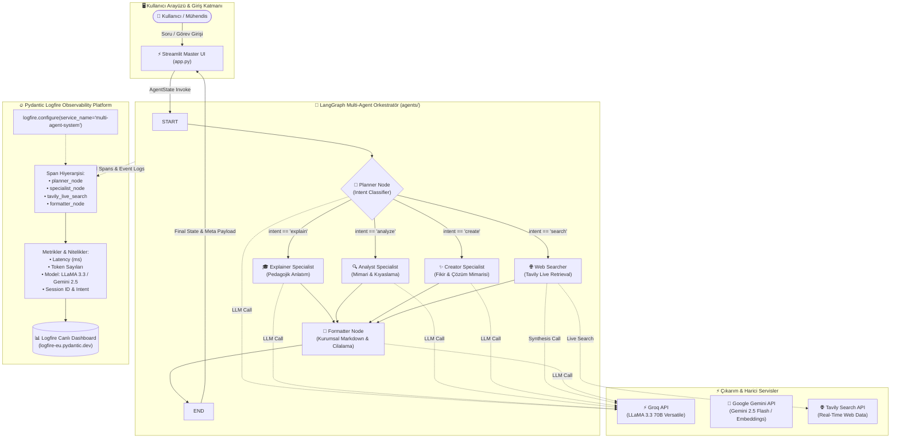

# ⚡ Nexus: Enterprise AI Agent Architecture & Observability with Pydantic Logfire

[](https://python.org)
[](https://logfire.pydantic.dev)
[](https://opentelemetry.io)
[](https://langchain-ai.github.io/langgraph/)
[](https://github.com/astral-sh/uv)
[_%7C_Gemini_2.5_Flash-00A67E.svg?style=for-the-badge)](https://groq.com)
[](https://streamlit.io)

---

## 📖 1. Yönetici Özeti ve Mimari Vizyon (Executive Summary)

**Nexus AI Studio**, modern Üretken Yapay Zeka (GenAI) sistemlerinin üretim ortamındaki en kritik iki ihtiyacını bir araya getiren kurumsal bir referans mimarisidir:
1. **Dinamik Çoklu Uzman Ajan Orkestrasyonu (Multi-Agent Routing with LangGraph):** Kullanıcı niyetini (intent) analiz ederek sorguyu pedagojik anlatıcı (Explainer), sistem mimarı ve kıyaslayıcı (Analyst), yaratıcı çözüm üretici (Creator) veya canlı web araştırmacısı (Web Searcher) uzmanlarına yönlendiren otonom bir akış.
2. **Uçtan Uca Semantik Gözlemlenebilirlik (End-to-End Semantic Observability with Pydantic Logfire):** Tüm LLM çağrılarını, token tüketimlerini, gecikme (latency) sürelerini, RAG vektör erişimlerini ve ajan dallanmalarını OpenTelemetry standardında yapılandırılmış izleme (tracing) verilerine dönüştüren gerçek zamanlı telemetri altyapısı.

### Neden Geleneksel Loglama Değil de Pydantic Logfire?

Geleneksel loglama kütüphaneleri (`logging`, `loguru`, metin dosyaları) LLM uygulamalarında yetersiz kalır çünkü LLM ardışık düzenleri (pipelines) deterministik değildir; çok adımlı, yüksek gecikmeli ve iç içe geçmiş (nested) çağrılardan oluşur.

```
Geleneksel Loglama: [2026-08-16 03:40:12] INFO: Calling LLM with query 'What is RAG?' -> string tabanlı, bağlamsız, metriksiz.
Pydantic Logfire:   Structured Spans + OpenTelemetry AST + Schema Validation + Token & Cost Attribution + Async Streaming.
```

* **OpenTelemetry Tabanlı Semantik İzler (Semantic Tracing):** Logfire, her fonksiyon çağrısını ve ajan geçişini birer `Span` olarak modeller. Üst ve alt span ilişkileri (parent-child hierarchy) ile bir sorgunun hangi düğümde kaç milisaniye harcadığı anında görselleştirilir.
* **Sıfır Yapılandırma ile LLM Entegrasyonu (`logfire.instrument_openai()`):** Groq ve Gemini gibi OpenAI uyumlu API çağrıları için istemler (prompts), yanıtlar, token sayıları ve tamamlama süreleri otomatik olarak yakalanır.
* **Pydantic Şema Doğrulama Entegrasyonu:** Veri modelleri (`LLMRequest`, `LLMResponse`, `AgentState`) doğrudan Logfire'a entegre edilerek veri bozulmaları ve şema uyuşmazlıkları anında tespit edilir.
* **İzlenebilirlik (Traceability & Session Correlation):** Kullanıcı oturumları (`session_id`) ve kullanıcı kimlikleri (`user_id`) izlere etiketlenerek üretimdeki hataların kök nedeni saniyeler içinde bulunur.

---

### Sistem Mimari Diyagramı (Mermaid.js)



---

## 📂 2. Dizin Yapısı ve Modül Analizi (Repository Breakdown)

```
Pydantic-LogFire/
├── .env                         # API anahtarları ve Logfire token yapılandırması
├── .python-version              # Python çalışma zamanı sürüm sabitleyici (3.13)
├── pyproject.toml               # Modern bağımlılık ve proje tanım dosyası (PEP 621)
├── uv.lock                      # Deterministik bağımlılık kilit dosyası
├── app.py                       # Master Streamlit UI/UX uygulaması
├── main.py                      # CLI başlangıç ve giriş noktası
├── documents.json               # RAG ve üretim LLM konuları için referans bilgi tabanı
├── pydantic_logfire.ipynb       # Logfire, Groq, Gemini ve RAG deney laboratuvarı
└── agents/                      # LangGraph Multi-Agent mimari paketi
    ├── __init__.py              # Paket dışa aktarımları
    ├── state.py                 # Tip güvenli AgentState şeması (TypedDict)
    ├── llm.py                   # Groq ve Gemini LLM istemci fabrikaları
    ├── trace.py                 # Merkezi Logfire başlatma ve konfigürasyon modülü
    ├── nodes.py                 # Planner, Uzmanlar, Web Searcher ve Formatter düğümleri
    └── graph.py                 # LangGraph StateGraph derleme ve koşullu yönlendirme
```

### Modül Sorumlulukları

| Modül / Dosya | Sorumluluk & Teknik Rol |
| :--- | :--- |
| **`agents/state.py`** | `AgentState` veri yapısını tanımlar. Düğümler arası taşınan soru, niyet, uzman taslağı, arama sonuçları, model zinciri, yürütülen düğüm yolu (`node_path`) ve oturum kimliğini tip güvenli olarak yönetir. |
| **`agents/llm.py`** | `groq_llm()` ve `gemini_llm()` factory fonksiyonlarını barındırır. Ortam değişkenlerini güvenli bir şekilde okur ve OpenAI uyumlu standart arayüz üzerinden LLaMA 3.3 70B ve Gemini 2.5 modellerini sunar. |
| **`agents/trace.py`** | Logfire telemetrisini yapılandırır (`setup_tracing`). Uzak Logfire sunucusuna OTel span'larını akıtırken terminal kilitlenmelerini önlemek amacıyla `console=False` optimizasyonunu sağlar ve OpenAI çağrılarını enstrümente eder. |
| **`agents/nodes.py`** | Tüm iş mantığı düğümlerini içerir. `planner` (niyet sınıflandırıcı), `explainer` (pedagojik anlatım), `analyst` (mimari analiz), `creator` (fikir üretimi), `web_searcher` (Tavily canlı arama ve sentez) ve `formatter` (kurumsal Markdown cilalama) fonksiyonlarını `logfire.span` bloklarıyla işletir. |
| **`agents/graph.py`** | LangGraph `StateGraph` sınıfını kullanarak başlangıç düğümünü (`START`), koşullu dallanmayı (`_route_intent`) ve `formatter` üzerinden `END` düğümüne bağlanan tam döngüyü derler (`g.compile()`). |
| **`app.py`** | Master seviye Streamlit kullanıcı arayüzü. Glassmorphism CSS stili, canlı telemetri göstergeleri (Groq, Gemini, Tavily, Logfire), oturum yönetimi, interaktif Logfire diagnostik akordeonu ve ilham verici hazır prompt çipleri sunar. |
| **`documents.json`** | LLM Production mimarileri (RAG, Guardrails, Gateway, Observability, Evals, Fine-tuning) üzerine 6 temel kurumsal dökümanı içeren yapılandırılmış bilgi tabanı. |
| **`pydantic_logfire.ipynb`** | Logfire temel loglamasından başlayıp; Pydantic veri doğrulama, Groq & Gemini kıyaslaması, FAISS vektör indeksi üzerinden RAG boru hattı izleme ve ReAct Agent araç çağırma adımlarını içeren 9 bölümlük kapsamlı eğitim defteri. |

---

## 🔍 3. Derinlemesine İnceleme: Logfire Enstrümantasyonu ve Telemetri (Masterclass)

### 1. Logfire Başlatma ve Konfigürasyon Deseni

Logfire'ın merkezi başlatılması `agents/trace.py` içerisinde gerçekleştirilir:

```python
import os
import logfire
from dotenv import load_dotenv

load_dotenv()

def setup_tracing() -> None:
    """
    Logfire gözlemlenebilirlik motorunu tüm uygulama için bir kez yapılandırır.
    Streamlit içinde st.cache_resource ile önbelleğe alınarak kullanılır.
    """
    token = os.getenv("LOG_FIRE_TOKEN") or os.getenv("LOGFIRE_TOKEN")
    try:
        if token:
            logfire.configure(
                token=token,
                service_name="multi-agent-system",
                send_to_logfire=True,
                console=False,  # Üretim ve Streamlit ortamlarında TTY kilitlenmesini engeller
            )
        else:
            logfire.configure(send_to_logfire=False, console=False)
            
        # OpenAI uyumlu LLM kütüphanelerini (Groq & Gemini) otomatik izlemeye al
        logfire.instrument_openai()
    except Exception as e:
        print(f"[Logfire Uyarı] Yapılandırma hatası: {e}")
```

### 2. Yapılandırılmış Özel Span Oluşturma (`logfire.span`)

Uygulamanın her adımı, anlamlı parametrelerle izole span'lara sarılır:

```python
import logfire

def planner(state: AgentState) -> dict:
    question = state["question"]
    session_id = state.get("session_id", "")
    
    # Span, bu blok içindeki tüm LLM çağrılarını ve yürütme süresini kapsar
    with logfire.span("planner_node", question=question, session_id=session_id):
        response = llm.invoke([...])
        intent = response.content.strip().lower()
        
        # Yapılandırılmış olay (Structured Event) kaydı
        logfire.info(
            "intent_classified",
            classified_intent=intent,
            raw_output=response.content,
            question=question
        )
        return {"intent": intent, "node_path": state.get("node_path", []) + ["planner"]}
```

### 3. Pydantic Modeli ile Veri Doğrulama ve İzleme (Notebook Örneği)

```python
from pydantic import BaseModel
import logfire

class LLMRequest(BaseModel):
    user_id: str
    session_id: str
    query: str
    model: str
    max_tokens: int

class LLMResponse(BaseModel):
    answer: str
    input_tokens: int
    output_tokens: int
    latency_ms: float
    model_used: str

# Span açılışı ve model doğrulaması
with logfire.span("llm_call_pipeline", user_id="Mustafa", session_id="sess_35"):
    req = LLMRequest(user_id="Mustafa", session_id="sess_35", query="What is RAG?", model="llama-3.3-70b", max_tokens=500)
    logfire.info("request_received", **req.model_dump())
    
    # LLM çağrısı simülasyonu / gerçek çağrı
    resp = LLMResponse(
        answer="RAG combines retrieval with generation...",
        input_tokens=18,
        output_tokens=120,
        latency_ms=342.5,
        model_used="llama-3.3-70b"
    )
    logfire.info("response_sent", **resp.model_dump())
```

---

## 🤖 4. Multi-Agent Yönlendirme ve İş Akışı Mimarisi (agents/)

Sistem, LangGraph tabanlı **StateGraph** üzerinde çalışır.

### State Tanımı (`agents/state.py`)

```python
from typing import TypedDict, List

class AgentState(TypedDict, total=False):
    question: str                  # Kullanıcı sorusu
    intent: str                    # Sınıflandırılan niyet ("explain" | "analyze" | "create" | "search")
    specialist_output: str         # Uzman düğümün ürettiği ham içerik
    search_results: str            # Web araması ham metin sonuçları (eğer varsa)
    final_answer: str              # Formatter tarafından cilalanmış son çıktı
    model_used: str                # Yürütülen model zinciri bilgisi
    session_id: str                # Oturum takip kimliği
    node_path: List[str]           # Yürütülen düğüm adımları listesi (örn: ['planner', 'analyst', 'formatter'])
    execution_time_ms: float       # Toplam gecikme süresi (ms)
    sources: List[str]             # Tavily arama kaynak URL'leri
```

### Koşullu Yönlendirme ve Graph Derleme (`agents/graph.py`)

```python
from langgraph.graph import StateGraph, START, END
from .state import AgentState
from .nodes import planner, explainer, analyst, creator, web_searcher, formatter

def _route_intent(state: AgentState) -> str:
    intent = state.get("intent", "explain")
    return intent if intent in ("explain", "analyze", "create", "search") else "explain"

def build_graph():
    g = StateGraph(AgentState)

    # 1. Düğümleri Kaydet
    g.add_node("planner", planner)
    g.add_node("explainer", explainer)
    g.add_node("analyst", analyst)
    g.add_node("creator", creator)
    g.add_node("web_searcher", web_searcher)
    g.add_node("formatter", formatter)

    # 2. Akış Kenarlarını Oluştur
    g.add_edge(START, "planner")
    
    # Koşullu Yönlendirme (Planner -> Uzman Düğüm)
    g.add_conditional_edges(
        "planner",
        _route_intent,
        {
            "explain": "explainer",
            "analyze": "analyst",
            "create":  "creator",
            "search":  "web_searcher",
        },
    )

    # Tüm uzmanlar Formatter düğümünde birleşir
    for specialist in ("explainer", "analyst", "creator", "web_searcher"):
        g.add_edge(specialist, "formatter")

    # Formatter çıktıyı kullanıcıya sunar ve akışı tamamlar
    g.add_edge("formatter", END)

    return g.compile()
```

---

## 🚀 5. Kurulum ve Hızlı Başlangıç (`uv` ile Sıfır Efor)

Proje, yeni nesil ultra hızlı Python paket yöneticisi olan **Astral `uv`** ile tam uyumludur.

### Adım 1: Depoyu Klonlayın
```bash
git clone https://github.com/MustafaKocamann/Pydantic-LogFire.git
cd Pydantic-LogFire
```

### Adım 2: Bağımlılıkları `uv` ile Yükleyin
`uv`, `pyproject.toml` ve `uv.lock` dosyalarındaki sanal ortamı (`.venv`) milisaniyeler içinde kurar:
```bash
# Sanal ortamı otomatik oluşturur ve kilitli bağımlılıkları senkronize eder
uv sync
```

### Adım 3: Ortam Değişkenlerini (`.env`) Ayarlayın
Kök dizinde `.env` dosyanızı oluşturun ve anahtarlarınızı girin:
```env
# Groq LLaMA Çıkarım API Anahtarı
GROQ_API_KEY=gsk_your_groq_api_key_here

# Google Gemini API Anahtarı
GOOGLE_API_KEY=your_gemini_api_key_here

# Tavily Canlı Web Arama API Anahtarı
TAVILY_API_KEY=tvly-your_tavily_api_key_here

# Pydantic Logfire Yazma Belirteci (Token)
LOG_FIRE_TOKEN=pylf_v1_your_logfire_token_here
```

### Adım 4: Logfire Kimlik Doğrulamasını Tamamlayın (İsteğe Bağlı)
```bash
uv run logfire auth
```

### Adım 5: Uygulamaları Başlatın

#### 🎨 Master Streamlit Web Arayüzünü Başlatma
```bash
uv run streamlit run app.py
```
*Tarayıcınızda otomatik olarak `http://localhost:8501` adresi açılacaktır.*

#### 🧪 Jupyter Notebook Laboratuvarını Başlatma
```bash
uv run jupyter lab pydantic_logfire.ipynb
```

---

## 🧪 6. Jupyter Notebook Deney Kılavuzu (`pydantic_logfire.ipynb`)

Notebook, adım adım derinleşen 9 modüler eğitim bölümünden oluşmaktadır:

```
[Bölüm 1] Ortam Doğrulama         ──> API anahtarları (Logfire, Groq, Gemini) kontrol edilir.
[Bölüm 2] Logfire Temelleri        ──> logfire.configure() ve logfire.info() ilk kaydı.
[Bölüm 3] Veri İşleme Spanleri     ──> with logfire.span(): Çok adımlı işlem simülasyonu ve süre takibi.
[Bölüm 4] Pydantic Doğrulaması    ──> LLMRequest ve LLMResponse şemalarıyla yapılandırılmış izleme.
[Bölüm 5] Groq Enstrümantasyonu   ──> LLaMA 3.3 70B model çağrısı ve otomatik OTel telemetrisi.
[Bölüm 6] Gemini Enstrümantasyonu  ──> Gemini 2.5 Flash model çağrısı ve gecikme ölçümü.
[Bölüm 7] Model Kıyaslaması       ──> Groq vs Gemini modellerine aynı sorgu gönderilerek latency benchmark.
[Bölüm 8] RAG Boru Hattı İzleme   ──> documents.json -> Google Embeddings -> FAISS -> logfire.span("rag_pipeline").
[Bölüm 9] ReAct Ajan & Tool Call  ──> search_knowledge_base aracı ile LangGraph ajan denemeleri.
```

---

## 📊 7. Bilgi Tabanı Şeması (`documents.json`)

RAG ve ReAct mimarilerinde bilgi tabanı olarak kullanılan `documents.json` dosyasındaki veri modeli şu şekildedir:

```json
[
  {
    "topic": "RAG",
    "source": "doc_1",
    "content": "Retrieval-Augmented Generation (RAG) combines information retrieval with text generation. When a user asks a question, RAG first retrieves relevant documents from a knowledge base using vector similarity search, then passes those documents along with the question to an LLM. This grounds the answer in actual content, which significantly reduces hallucinations compared to pure LLM generation."
  },
  {
    "topic": "Guardrails",
    "source": "doc_2",
    "content": "LLM Guardrails are safety controls that sit between the user and the language model. They run before the LLM sees the input (input rails) and after the LLM generates output (output rails). NVIDIA NeMo Guardrails uses a domain-specific language called Colang to define rules declaratively. Common guardrails include prompt injection detection, PII filtering, toxicity filtering, and topic restriction."
  }
]
```

Bu veri yapısı, LangChain `Document(page_content=..., metadata={"topic": ..., "source": ...})` nesnelerine dönüştürülerek vektör veritabanına indekslenir.

---

## 🛡️ 8. Üretim Ortamı ve Güvenlik Önerileri (Production Best Practices)

1. **PII ve Hassas Veri Maskeleme:**
   Üretim ortamında kullanıcıların TC kimlik no, kredi kartı veya API anahtarlarının Logfire'a düz metin olarak gitmesini önlemek için Logfire scrubbing (temizleme) filtrelerini etkinleştirin:
   ```python
   logfire.configure(
       scrubbing=logfire.ScrubbingOptions(mask_patterns=[r'\b[A-Za-z0-9._%+-]+@[A-Za-z0-9.-]+\.[A-Z|a-z]{2,}\b'])
   )
   ```
2. **Örnekleme Oranları (Sampling Rates):**
   Yüksek trafikli sistemlerde maliyet ve ağ yükünü dengelemek için örnekleme oranını yapılandırın:
   ```python
   logfire.configure(sample_rate=0.2) # Gelen isteklerin %20'sini tam detayla izler
   ```
3. **Zaman Aşımı ve Fallback Mekanizmaları:**
   Tavily veya LLM sağlayıcılarında yaşanabilecek ağ kesintilerine karşı `try-except` blokları içinde `logfire.warning("service_fallback", error=str(e))` deseni kullanılmalı ve ajan doğrudan genel bilgi moduna geçmelidir.

---

## 🤝 9. Katkıda Bulunma ve Lisans

Katkıda bulunmak için lütfen bir **Pull Request** açın veya bir **Issue** oluşturun:
1. Depoyu forklayın (`Fork`).
2. Özellik dalınızı oluşturun (`git checkout -b feature/amazing-feature`).
3. Değişikliklerinizi commit edin (`git commit -m 'feat: Add amazing feature'`).
4. Dalınıza push yapın (`git push origin feature/amazing-feature`).
5. Bir Pull Request açın.

Bu proje **MIT Lisansı** altında lisanslanmıştır. Detaylar için `LICENSE` dosyasına bakabilirsiniz.
