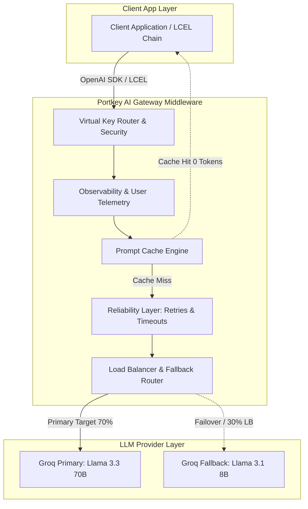

# 🛡️ Enterprise AI Security & Gateway Middleware Architecture

[](https://www.python.org/)
[](https://portkey.ai/)
[](https://groq.com/)
[](https://www.langchain.com/)
[](#security--governance)

A production-grade reference architecture, interactive notebook, and implementation guide for building **resilient, secure, and observable LLM infrastructure**. This project demonstrates enterprise gateway middleware patterns—including **Virtual Key security, granular multi-tenant observability, automated retries, request timeout SLAs, fallback failover routing, weighted load balancing, prompt caching, and native LangChain integration**.

---

## 📌 Executive Summary

Deploying LLMs into enterprise production environments introduces critical security, reliability, and cost-control challenges:
- **Credential Leakage**: Raw API keys exposed across distributed application microservices.
- **Uncontrolled Costs & Latency**: Lack of centralized rate-limiting, user-level cost attribution, and caching.
- **Single Point of Failure (SPOF)**: Rate limits (HTTP 429) or cloud provider downtime breaking application workflows.

This repository implements **Portkey AI Gateway** as a control plane between application code and underlying LLM infrastructure (Groq Llama 3.3 70B & Llama 3.1 8B), ensuring zero-downtime reliability and enterprise-grade telemetry without intrusive code modifications.

---

## 🏗️ System Architecture



---

## ✨ Enterprise Gateway Features & Architectural Patterns

### 1. 🗝️ Virtual Keys & Credential Abstraction
* **Security Model:** Decouples raw provider API keys (`gsk_...`) from application source code using Virtual Key Slugs (`@gkey/llama-3.3-70b-versatile`).
* **Governance:** Centralizes access control, rate-limits, and key revocation within the Portkey control plane.

### 2. 📊 Granular Observability & Multi-Tenant Telemetry
* **User & Feature Attribution:** Uses `.with_options(metadata=...)` to inject `_user`, `session_id`, `feature`, and `environment` headers.
* **Audit Logging:** Automatically tracks total token consumption, per-request execution costs, and end-to-end latency per user.

### 3. 🛡️ Fault Tolerance & SLA Enforcement
* **Automatic Retries:** Configured exponential backoff (e.g., 3 attempts) for transient errors (`HTTP 429, 500, 502, 503, 504`).
* **Request Timeouts:** Hard SLA latency caps (e.g., 10,000ms) issuing `HTTP 408` to prevent process hanging.
* **Fallback Routing:** High-availability seamless failover from primary model (`Llama-3.3-70B`) to fallback target (`Llama-3.1-8B`) upon provider failure.

### 4. ⚖️ Weighted Load Balancing
* **Traffic Splitting:** Probabilistically splits traffic (e.g., 70% large 70B tier / 30% small 8B tier) to optimize cost-per-query while preserving response quality.

### 5. ⚡ Prompt Caching & Performance Acceleration
* **Cost Elimination:** Intercepts redundant prompts at the Gateway level, returning instant responses (`Cache HIT`) with **0 token cost** and up to **2.4x+ latency reduction**.

### 6. 🔗 LangChain Native Integration
* **Drop-In Middleware:** Uses LangChain's `ChatOpenAI` configured with Portkey's Gateway URL and custom `x-portkey-*` headers to elevate standard LCEL pipelines with gateway capabilities.

---

## 🛠️ Repository Structure

```text
├── portkey-ai-book.ipynb   # Main interactive notebook with full code examples & benchmarks
├── .env.example             # Environment variable template (copy to .env)
├── .gitignore               # Environment and secret isolation configuration
├── pyproject.toml           # Project dependencies & environment definition
├── uv.lock                  # Lockfile for reproducible builds
└── README.md                # Project architecture & technical documentation
```

---

## 🚀 Quickstart & Setup Guide

### Prerequisites
- **Python 3.10+**
- **Portkey Account & API Key**: [portkey.ai](https://portkey.ai/)
- **Groq API Key**: [console.groq.com](https://console.groq.com/)

### 1. Clone the Repository
```bash
git clone https://github.com/MustafaKocamann/ai-security.git
cd ai-security
```

### 2. Set Up Environment & Install Dependencies
Using [`uv`](https://github.com/astral-sh/uv) (recommended):
```bash
uv sync
```
Or using standard `pip`:
```bash
python -m venv .venv
source .venv/bin/activate  # On Windows: .venv\Scripts\activate
pip install portkey-ai langchain-groq langchain-openai python-dotenv colorama
```

### 3. Configure Environment Variables
Copy `.env.example` to `.env` and populate your API credentials:
```bash
cp .env.example .env
```
Fill in `.env`:
```env
PORTKEY_API_KEY=pk-xxxxxxxxxxxxxxxxxxxxxxxx
GROQ_API_KEY=gsk_xxxxxxxxxxxxxxxxxxxxxxxx
```

### 4. Run the Interactive Notebook
Launch Jupyter Notebook or open `portkey-ai-book.ipynb` directly in VS Code / Jupyter Lab:
```bash
jupyter notebook portkey-ai-book.ipynb
```

---

## 💻 Full Production Config Pattern Example

The following JSON schema demonstrates a unified enterprise Gateway configuration combining Fallback Routing, SLA Timeouts, Retries, and Simple Prompt Caching:

```python
PRODUCTION_CONFIG = {
    "strategy": {"mode": "fallback"},
    "request_timeout": 30000,                  # 30-second hard latency budget
    "retry": {
        "attempts": 2,                         # 2 retry attempts on transient errors
        "on_status_codes": [429, 500, 503]
    },
    "cache": {"mode": "simple"},               # Exact-match prompt caching
    "targets": [
        {"override_params": {"model": "@gkey/llama-3.3-70b-versatile"}},  # Primary Target
        {"override_params": {"model": "@gkey2/llama-3.1-8b-instant"}}     # Fallback Target
    ]
}
```

---

## 🔐 Security & Governance Best Practices

1. **Never Commit Secrets**: Raw API keys must remain strictly inside `.env` (ignored via `.gitignore`).
2. **Use Virtual Keys**: Restrict provider keys within the Portkey control plane; expose only Virtual Key Slugs to client applications.
3. **Audit Trail Compliance**: Monitor real-time request logs, token usage, and user metadata directly on the Portkey AI Gateway Dashboard.

---

## 👨‍💻 Author & Contributions

* **Author**: Mustafa Kocaman
* **Focus**: AI Security, Guardrails, Gateways & Enterprise LLM Infrastructure
* **GitHub**: [@MustafaKocamann](https://github.com/MustafaKocamann)
